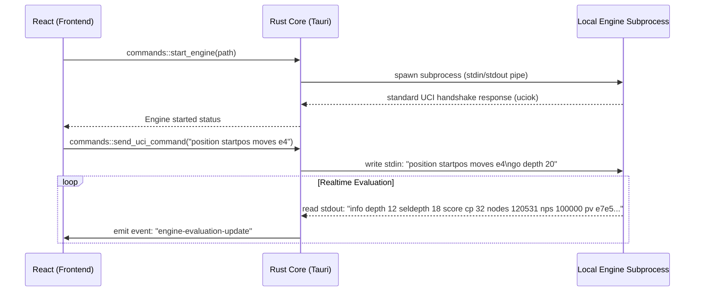
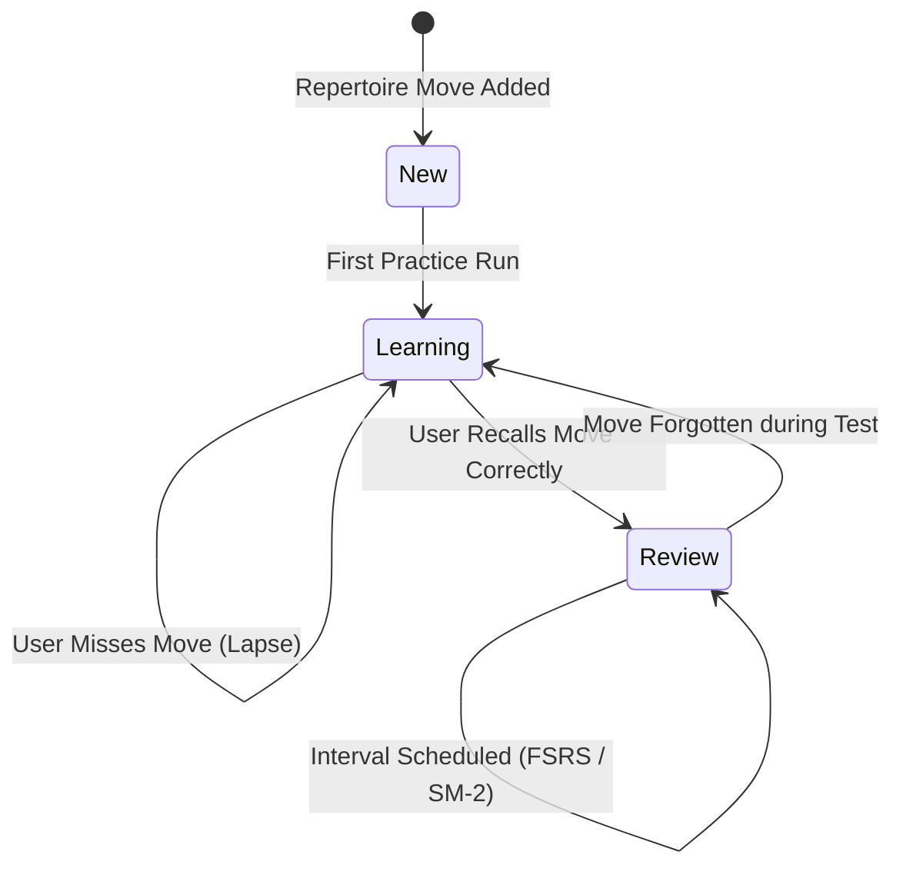

<p align="center">
  
</p>

<h1 align="center">♞ Reckless AI</h1>

<p align="center">
  <strong>A Premium, Offline-First Chess Database, Position Indexer & UCI Analysis Workspace</strong><br/>
  <em>A high-performance desktop application fusing Rust native core execution with a visual React 19 interface.</em>
</p>

<p align="center">
  <a href="LICENSE"></a>
  <a href="https://tauri.app/"></a>
  <a href="https://www.rust-lang.org/"></a>
  <a href="https://react.dev/"></a>
  <a href="#"></a>
</p>

<br/>

<p align="center">
  Reckless AI is a premium, offline-first desktop chess tool tailored for advanced players, database curators, and engine analysts. Unlike basic web interfaces, Reckless AI integrates a high-speed local database engine capable of parsing, sorting, and indexing millions of chess games. By compiling custom memory-mapped index files, executing local UCI engines directly as OS subprocesses via Rust, and managing repertoires with spaced-repetition training models, it offers a fully unified chess workstation wrapped in a state-of-the-art glassmorphic user interface.
</p>

---

## 📑 Table of Contents

<details>
<summary><strong>Click to expand table of contents</strong></summary>

- [⚡ Quick Start](#-quick-start)
  - [Prerequisites](#prerequisites)
  - [Setup in 3 Steps](#setup-in-3-steps)
  - [Running Tests & Linters](#running-tests--linters)
- [🏛️ Architectural Deep-Dive](#%EF%B8%8F-architectural-deep-dive)
  - [1. Native UCI Subprocess & Engine Orchestration](#1-native-uci-subprocess--engine-orchestration)
  - [2. Memory-Mapped Position Indexing (.ecsi)](#2-memory-mapped-position-indexing-ecsi)
  - [3. Database Storage & Diesel Schema](#3-database-storage--diesel-schema)
  - [4. Spaced Repetition Repertoire Training](#4-spaced-repetition-repertoire-training)
  - [5. Tauri IPC command & Event Bridge](#5-tauri-ipc-command--event-bridge)
- [📁 Detailed Project Structure](#-detailed-project-structure)
- [✨ Premium UI/UX Redesigns](#-premium-uiux-redesigns)
  - [App-wide Sidebar Redesign](#app-wide-sidebar-redesign)
  - [Horizontal Ratings Dashboard with Neon Sparklines](#horizontal-ratings-dashboard-with-neon-sparklines)
  - [Interactive Chessboard Hero & Actions Grid](#interactive-chessboard-hero--actions-grid)
  - [Recent Files Workspace Registry](#recent-files-workspace-registry)
- [🎨 Visual Design Tokens & Custom CSS](#-visual-design-tokens--custom-css)
- [🔧 Building from Source](#-building-from-source)
- [📦 Technology Stack](#-technology-stack)
- [📄 License](#-license)

</details>

---

## ⚡ Quick Start

### Prerequisites

To compile Reckless AI from source, the following system requirements must be set up on your machine:

| Tool | Minimum Version | Installation Target | Purpose |
|:-----|:----------------|:--------------------|:--------|
| **Node.js** | v18+ (LTS) | [nodejs.org](https://nodejs.org/) | Frontend package management and packaging scripts |
| **Rust / Cargo** | stable (1.75+) | [rustup.rs](https://rustup.rs/) | Native backend compilation and binary linking |
| **pnpm** | v8+ | `npm install -g pnpm` | Ultra-fast front-end package caching |
| **C++ Build Tools** | VS Build Tools / GCC | MSVC workload (Windows) | Required for native bindings compilation |

### Setup in 3 Steps

```bash
# 1 · Clone the repository
git clone https://github.com/Kavyargb/XAI.git
cd XAI

# 2 · Install frontend dependencies
pnpm install

# 3 · Launch in Developer Mode
pnpm dev
```

> [!TIP]
> Executing `pnpm dev` boots up Vite's HMR server on port `1420` and triggers Tauri's compiler, wrapping the web interface inside a native webview window. All standard console outputs are piped directly back to your shell.

### Running Tests & Linters

Reckless AI maintains code quality through integrated testing and static analysis tools:

```bash
# Run unit and integration tests (Vitest)
pnpm test

# Check syntax styling and run TypeScript static analysis
pnpm lint

# Automatically resolve style issues
pnpm lint:fix
```

---

## 🏛️ Architectural Deep-Dive

Reckless AI is engineered around the separation of UI concerns and native operations. The layout splits workloads between a single React GUI thread and multiple native workers:

```
  ┌─────────────────────────────────────────────────────────────┐
  │                   GUI Layer (React 19)                      │
  │  - Render chessground board    - State management (Jotai)   │
  │  - Parse local/recent files    - Render SVG graph panels    │
  └──────────────────────────────┬──────────────────────────────┘
                                 │
                   Tauri IPC Command & Event Bridge
                                 │
  ┌──────────────────────────────▼──────────────────────────────┐
  │                 Tauri Native Core (Rust)                    │
  │  - SQLite database access      - Shakmaty chess logic       │
  │  - Engine tokio process spawn  - Index searches (.ecsi)     │
  └──────────────────────────────┬──────────────────────────────┘
                                 │
                        OS Standard I/O (UCI)
                                 │
  ┌──────────────────────────────▼──────────────────────────────┐
  │                    Local Chess Engine                       │
  │  - Reckless AI.exe (64.7MB UCI executable backend)          │
  └─────────────────────────────────────────────────────────────┘
```

---

### 1. Native UCI Subprocess & Engine Orchestration

Reckless AI launches chess engines as OS subprocesses via the Rust core backend, using asynchronous `tokio::process::Command` bindings. 



#### Key Subprocess Operations:
* **Lifecycle Protection**: If the GUI thread crashes or closes, the Rust backend intercepts the drop event, writes `quit` to the engine subprocess stdin channel, and forcibly terminates the process hierarchy after a `500ms` grace period to prevent zombie processes.
* **Multi-PV Thread Management**: The engine interface parses detailed UCI evaluation metrics (`score cp`, `score mate`, `depth`, `nps`, `nodes`, `pv`) in real time, converting them into structured JSON packets sent via Tauri events.

---

### 2. Memory-Mapped Position Indexing (.ecsi)

For near-instantaneous position searching across large game archives, Reckless AI compiles databases into a custom format: **En Croissant Search Index (`.ecsi`)**. 

```
.ecsi Binary File Structure:
┌─────────────────────┬───────────────────────┬────────────────────────┐
│   Header Section    │    Zobrist Keys Map   │     Game Offsets List  │
│  - Version (4B)     │   - FEN Hash 1 (8B)   │    - Game Index 1 (4B) │
│  - Index Count (4B) │   - FEN Hash 2 (8B)   │    - Game Index 2 (4B) │
│  - Reserved (24B)   │   - FEN Hash N (8B)   │    - Game Index N (4B) │
└─────────────────────┴───────────────────────┴────────────────────────┘
```

* **Memory Mapping (`memmap2`)**: The search index uses OS-level memory mapping. Instead of loading gigabytes of indices into RAM, the file is mapped directly into the process's virtual memory address space. The OS pages the required offsets on demand, achieving $O(1)$ search lookups.
* **Zobrist Position Hashing**: Each unique chess board state is represented as a 64-bit Zobrist key. FEN strings are translated into these hashes, which are sorted inside the binary search files. A binary search on the memory-mapped file retrieves matching game references in microseconds.

---

### 3. Database Storage & Diesel Schema

All games, repertoires, and players are structured in local SQLite databases managed via the **Diesel ORM** framework in Rust.

#### Database Schema Details:
* **`Games`**: Stores game metadata including FEN, PGN tags (Event, Site, Date, Round, White, Black, Result), White ELO, Black ELO, and full game move histories.
* **`Players`**: Maps usernames (including Chess.com and Lichess handles) to their database references, allowing the app to calculate win-loss stats locally.
* **`Repertoires`**: Tracks custom opening repertoires, grouping move sequences as branching trees rather than sequential list paths.

---

### 4. Spaced Repetition Repertoire Training

To build and practice chess opening lines, Reckless AI incorporates an offline spaced repetition training engine.



#### Practice Scheduling:
* **SM-2 / FSRS Scheduling**: Custom algorithms calculate interval multipliers based on review history. Correctly remembered opening moves increase in review interval length, whereas incorrect moves reset the state.
* **Branching Training Paths**: The engine tracks variations. During training, the board prompts the user to input the correct move. If the user plays an alternative line defined in their repertoire, the app automatically switches training context to that branch.

---

## 📁 Detailed Project Structure

Below is an overview of the key folders and files that structure the Reckless AI workspace:

```
XAI/
├── 📁 src/                                  Frontend React & TS modules
│   ├── 📁 bindings/                         Generated type bindings
│   │   └── generated.ts                     Type schemas mapped from Rust structs
│   ├── 📁 components/                       Re-usable visual components
│   │   ├── 📁 boards/                       Chessboard panels
│   │   │   ├── Board.tsx                    Interactive Chessground component
│   │   │   └── BoardAnalysis.tsx            Multi-PV engine evaluation panel
│   │   ├── 📁 databases/                    Workspace file database views
│   │   │   └── Databases.tsx                Database manager with active profile selectors
│   │   ├── 📁 home/                         User overview panels
│   │   │   └── PersonalCard.tsx             Profile panel wrapper containing user stats
│   │   └── 📁 tabs/                         Dashboard tab contents
│   │       ├── NewTabHome.tsx               Landing home dashboard featuring files & ratings
│   │       └── NewTabHome.module.css        Glassmorphic layout styling rules
│   ├── 📁 state/                            Global store directories
│   │   ├── atoms.ts                         Jotai atomic values (recentFilesAtom, sessionsAtom)
│   │   └── store/                           Zustand state managers (database store)
│   ├── 📁 styles/                           Aesthetic themes
│   │   ├── global.css                       Core design styles & dark mode layout rules
│   │   └── theme.ts                         Mantine provider customization tokens
│   └── 📁 utils/                            Helper functions
│       ├── db.ts                            SQLite database loaders
│       ├── files.ts                         Programmatic PGN file opening functions
│       └── timeControl.ts                   Website time control parsing utility
│
├── 📁 src-tauri/                            Native Rust backend application
│   ├── 📁 src/                              Source code directories
│   │   ├── 📁 db/                           Diesel database structures
│   │   │   ├── models.rs                    SQL data models
│   │   │   └── schema.rs                    Diesel SQL schemas
│   │   ├── 📁 engine/                       UCI Process Manager
│   │   │   └── mod.rs                       Process piping and drop hooks
│   │   ├── 📁 index/                        Memory-mapped index searcher
│   │   │   └── mod.rs                       Binary search file parsing engine
│   │   └── main.rs                          Tauri main process registration and IPC commands
│   ├── Cargo.toml                           Cargo dependencies list
│   └── tauri.conf.json                      Tauri configuration file
│
├── Reckless AI.exe                          ⚡ Restored native chess engine resource (64.7MB)
├── reckless-ai.exe                          ⚡ Native desktop client executable (36.3MB)
└── package.json                             Vite & node packages and scripts config
```

---

## ✨ Premium UI/UX Redesigns

Reckless AI's visual design is built around a modern dark theme featuring glassmorphism, responsive columns, and neon glow accents.

### App-wide Sidebar Redesign
* **Increased Navigation Width**: Expanded sidebar layout to `240px` in `__root.tsx`, providing space for text labels alongside navigation icons.
* **Glow Pill Indicators**: Active pages display a glowing background pill:
  ```css
  background: rgba(0, 180, 216, 0.08);
  border: 1px solid rgba(0, 180, 216, 0.25);
  box-shadow: 0 0 12px rgba(0, 180, 216, 0.15);
  ```
* **Dynamic Profile Integration**: Renders user details at the bottom of the sidebar, pulling ELO stats from active Chess.com or Lichess sessions, complete with custom avatar frames and master badges.

---

### Horizontal Ratings Dashboard with Neon Sparklines

```
┌────────────────────────────────────────────────────────────────────────┐
│                        RATING SUMMARY DASHBOARD                        │
│ ┌────────────────┐ ┌────────────────┐ ┌────────────────┐ ┌───────────┐ │
│ │   RAPID        │ │   BLITZ        │ │   CLASSICAL    │ │  PUZZLES  │ │
│ │   1884   ▲ 18  │ │   1140   ▼ 2   │ │   1500    ▲ 0  │ │  2450     │ │
│ │   (Chess.com)  │ │   (Chess.com)  │ │   (Chess.com)  │ │  (Lichess)│ │
│ │   📈 (Real)    │ │   📉 (Real)    │ │   ➖ (Real)    │ │  📈 (Real)│ │
│ └────────────────┘ └────────────────┘ └────────────────┘ └───────────┘ │
└────────────────────────────────────────────────────────────────────────┘
```

* **Prioritized Accounts**: Fetches Blitz, Rapid, and Classical (Daily) stats from **Chess.com** first.
* **Lichess Puzzle Sync**: Automatically queries **Lichess** to populate your tactical Puzzle ELO.
* **Dynamic Sparklines**: The charts are generated directly from historical game rating points found inside your databases:
  ```typescript
  // Dynamically maps arbitrary rating points to fit inside a 90x50 SVG box
  const points = history.map((val, idx) => {
    const x = paddingX + (idx / (history.length - 1)) * width;
    const y = paddingY + height - ((val - min) / range) * height;
    return `${x.toFixed(1)},${y.toFixed(1)}`;
  });
  ```

---

### Interactive Chessboard Hero & Actions Grid
* **Visual Hero Banner**: Displays a banner highlighting "Play Chess", using a dark gradient overlay on a high-contrast chessboard backdrop.
* **Vibrant Quick Actions**: Four dashboard cards (**Analysis Board**, **Puzzles**, **New Repertoire**, **Import Game**) feature color-coded bottom borders (Cyan, Purple, Green, Orange) that slide and glow on hover.

---

### Recent Files Workspace Registry
* **Workspace Tracker**: Replaces static game lists with a live **Recent Files** registry.
* **Type-Based Icons**: Renders matching icons based on file type (Repertoires, Games, Puzzles, Tournaments).
* **Launch on Click**: Row clicks automatically trigger programmatic file loads to open the selected database in a new workspace tab.
* **Easy Clean-Up**: Includes a hover-delete trash icon to prune files from your workspace history.

---

## 🎨 Visual Design Tokens & Custom CSS

The visual theme is defined in `src/components/tabs/NewTabHome.module.css` and `src/styles/global.css`:

```css
/* Core Design Variables */
:root {
  --bg-deep-void: #0a0c10;
  --bg-glass-card: rgba(16, 20, 30, 0.65);
  --border-glass: 1px solid rgba(255, 255, 255, 0.08);
  --glow-cyan: rgba(0, 180, 216, 0.4);
  --glow-purple: rgba(155, 89, 182, 0.4);
  --transition-smooth: 180ms cubic-bezier(0.4, 0, 0.2, 1);
}

/* Glassmorphic Panel Base */
.glassPanel {
  background: var(--bg-glass-card);
  backdrop-filter: blur(16px);
  border: var(--border-glass);
  border-radius: 12px;
  transition: var(--transition-smooth);
}

/* Sparkline Path Shadow Filter */
.glowPath {
  filter: drop-shadow(0px 2px 6px var(--glow-cyan));
}
```

---

## 🔧 Building from Source

To compile and package Reckless AI as a production desktop app:

### 1. Build Command
```bash
pnpm build
```

This triggers the frontend compiler (`vite build`) to bundle index pages into the `dist/` directory, and runs the Rust compiler to generate the optimized target release build.

### 2. Output Binaries
* **`reckless-ai.exe` (GUI App)**: Outputted to `src-tauri/target/release/reckless-ai.exe`.
* **`Reckless AI.exe` (Engine)**: Loaded from the workspace root and packaged directly inside the app's resource folder.

---

## 📦 Technology Stack

Reckless AI is built on the following stack:

| Layer | Dependency | Version | Purpose |
|:------|:-----------|:--------|:--------|
| **Core Client** | [React](https://react.dev/) | `v19.2.4` | Component lifecycle rendering |
| **System Binder** | [Tauri](https://tauri.app/) | `v2.10.1` | OS bridging, window management, and Rust binding hooks |
| **UI Components** | [Mantine](https://mantine.dev/) | `v8.3.14` | Theming and design system tokens |
| **Board Renderer** | [Chessground](https://github.com/lichess-org/chessground) | `v10.1.1` | Interactive, responsive chess board widget |
| **Local Database** | [SQLite](https://www.sqlite.org/) | `v3` | Offline-first database storage |
| **ORM Interface** | [Diesel](https://diesel.rs/) | `v2` | High-speed Rust compiler SQL mapper |
| **Board Logic** | [Shakmaty](https://github.com/niklasf/shakmaty) | `v0.26` | Complete move generation rules and validation |

---

## 📄 License

This software is open-source and licensed under the **GPL-3.0 License**.
